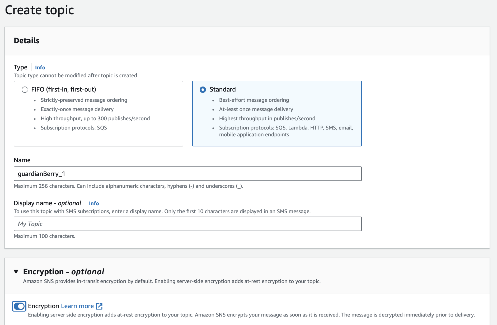
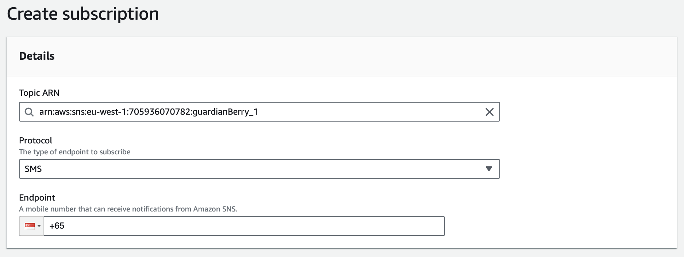
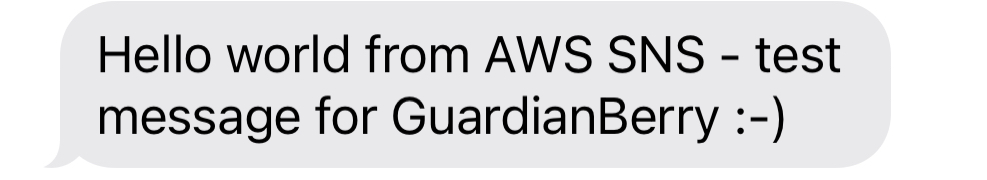
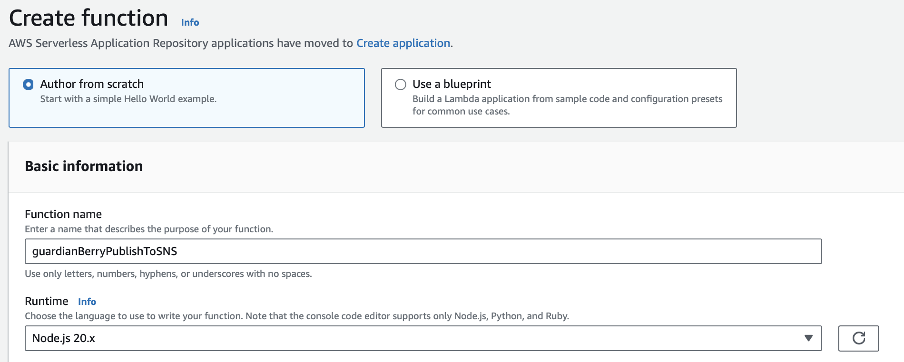
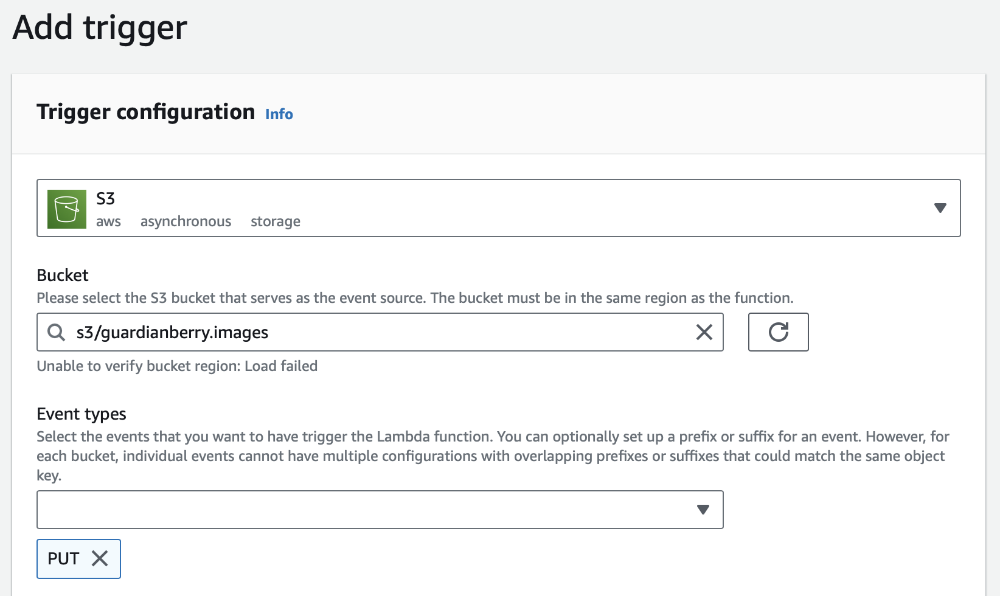
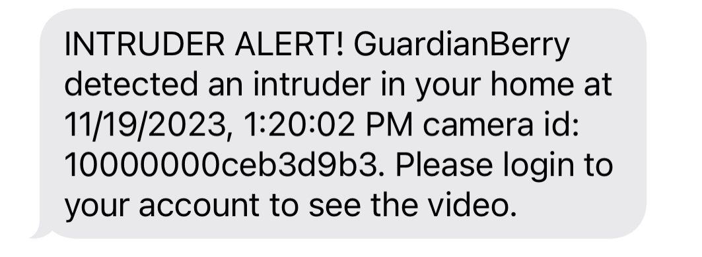

# Configuring AWS services to send an SMS notification

These instructions cover these steps:
- Setting up an SNS Topic and subscribing a mobile endpoint to the Topic for SMS messages
- Creating a Lambda function to process S3 file upload events and publish a notification to SNS
- Triggering the Lambda function on S3 file upload

## 1. Setting up an SNS Topic and subscribing a mobile endpoint to the Topic for SMS messages

### Setting up an SNS Topic
The AWS Simple Notification Service uses the concept of Topics. These are a way to create a communications channel with a group subscribers around a common theme.

I decided to associate a Topic as a single Home. Then everyone interested in security notifications about the Home - for example people living there - could subscribe to the Topic. This architecture would also allow for multiple Raspberry devices to be associated with a single Home.

Based on this I decided to name Topics as `guardianBerry_<homeId>` where `homeId` was the unique identifier for a Home. I created the first topic named `guardianBerry_1` - shown in the image below.


Notes:
1. The type is set to Standard as opposed to FIFO as only Standard SNS Topics support SMS messages.
2. Encryption is enabled which means that messages that are waiting to be sent are encrypted ('_encryption at rest_').

### Creating a Mobile Endpoint and subscribing to the Topic

The next step was to subscribe a mobile endpoint to the `guardianBerry_1` Topic. This is easy to do in the AWS console, requiring selecting the Topic and then entering the mobile number, as shown below:




### Sending a test message

The final step was to publish a message to the Topic and check it was received correctly on the mobile. This again is easy to do using the AWS console. The test message received is shown below.




## 2. Creating a Lambda function to process S3 file upload events and publish a notification to SNS

AWS Lambda functions are serverless functions that are fully managed by AWS - with no need to setup and maintain servers and scale up and down servers based on demand. All of this is taken care of by AWS.

There are several languages available for writing Lambda functions including Node, Python and Java. Based on my experience I chose to use Node as the programming language.

I created a new Lambda function called `guardianBerryPublishToSNS1` together with a new IAM role with permission to run Lambda functions, get the metadata from S3 objects and publish SNS messages. The lambda create function screen is shown below:


A subset of the new IAM role for the lambda function is shown below. This restricts S3 access to the `guardianberry.images` bucket and restricts SNS Topic publishing to topics that begin with `guardianBerry_`:

```
{
    "Version": "2012-10-17",
    "Statement": [
        {
            "Effect": "Allow",
            "Action": [
                "s3:GetObject"
            ],
            "Resource": "arn:aws:s3:::guardianberry.images/*"
        },
        {
            "Effect": "Allow",
            "Action": "sns:Publish",
            "Resource": "arn:aws:sns:eu-west-1:705936070782:guardianBerry_*"
        }
    ]
}
```

## 3. Triggering the Lambda function on S3 file upload
The final step is to setup a trigger from the S3 `PutObject` event on the `guardianberry.images` bucket to the `guardianBerryPublishToSNS1` lambda function.

This is easy to do through the AWS console and is shown in the image below:



Once this is all put together, the creation of a new file in the guardianberry.images folder triggers an SMS to the author's mobile phone number. Example SMS:


