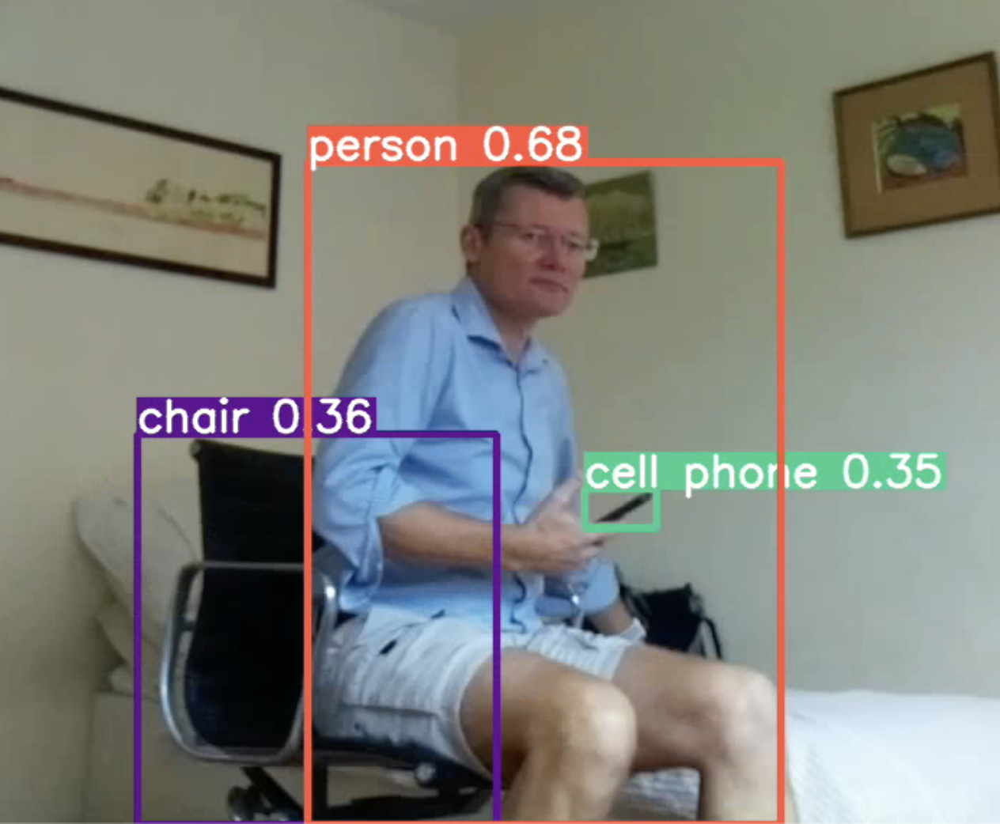

# Raspberry Pi Installation Notes

The hardware used:
- Raspberry Pi 4 Model B Rev 1.2
- 16GB SD card
- Raspberry Pi Camera Module 2.1

These instructions cover these steps:
- Install Raspberry Pi OS
- Setup Raspberry Pi for SSH access over Wifi
- Login to the Raspberry Pi over SSH
- Check the Raspberry Pi camera is working
- Install the necessary software packages and YOLOv5
- Test YOLOv5

## A. Install Raspberry Pi OS
### 1. Download the Raspberry Pi Imager
Source [https://www.raspberrypi.com/software/](https://www.raspberrypi.com/software/)

### 2. Use the Imager software to install Raspberry Pi OS Lite (64-bit), Debian version 12 (bookworm)
Source [https://downloads.raspberrypi.com/raspios_lite_arm64/images/raspios_lite_arm64-2023-10-10/2023-10-10-raspios-bookworm-arm64-lite.img.xz](https://downloads.raspberrypi.com/raspios_lite_arm64/images/raspios_lite_arm64-2023-10-10/2023-10-10-raspios-bookworm-arm64-lite.img.xz)

## B. Setup Raspberry Pi for SSH access over Wifi
### 1. Enable SSH
Add a blank file called `ssh` (no extension) to the SD card boot partition

### 2. Enable Wifi
Create a file called `wpa_supplicant.conf` in the boot partition. Add these lines to the file:

```
country=GB
ctrl_interface=DIR=/var/run/wpa_supplicant GROUP=netdev
update_config=1

network={
   ssid="YOUR_WIFI_SSID"
   psk="YOUR_WIFI_PASSWORD"
   priority=1
}
```
Replace `YOUR_WIFI_SSID` and `YOUR_WIFI_PASSWORD` with the details for your network.

### 3. Create an encrypted admin password
Issue this command on a linux machine:
```
echo 'YOUR_PASSWORD' | openssl passwd -6 -stdin
```
where `YOUR_PASSWORD` is the new password you want to use.

### 4. Create the admin user
Create a file called `userconf` in the boot partition. Add this line to the file:
```
YOUR_USER_NAME:ENCRYPTED_PASSWORD
```
where `YOUR_USER_NAME` is, for example, admin and `ENCRYPTED_PASSWORD` is the long string generated in step 3 above.

## C. Login to the Raspberry Pi over SSH
### 1. Find the IP address of the Raspberry Pi
The easiest way to do this is to login to your router and look at the connected clients. Typically the Raspberry Pi will a client name of 'raspberrypi'.

If this is not possible you can download the [Fing app](https://www.fing.com/products/fing-app) to scan your local network.

### 2. Issue this command at the terminal:
```
ssh YOUR_USER_NAME@IP_ADDRESS
```
Replacing `YOUR_USER_NAME` with the user name from the userconf file and `IP_ADDRESS` with the IP address of the Raspberry Pi. For example:
```
ssh admin@192.168.50.221
```
Enter the password when prompted.

## D. Check the Raspberry Pi camera is working
_If you have a monitor plugged in to the Raspberry Pi_

Issue this command:
```
libcamera-hello
```
The monitor will show the camera image for 5 seconds. Increase the timeout by appending `-t [duration]sec`. Example:
```
libcamera-hello -t 100sec
```

_If you don't have a monitor_

Take these steps:
Take a still image from the camera and save it to the Raspberry Pi current directory as 'test.jpg':
```
libcamera-still -o test.jpg
```

Retrieve this image from the Raspberry Pi by using another terminal window and the scp command:
```
scp YOUR_USER_NAME@IP_ADDRESS:test.jpg .
```
For example
```
scp admin@192.168.50.222:test.jpg .
```

## E. Install the necessary software packages and YOLOv5
### 1. Update the list of packages and the distribution
```
sudo apt-get update
sudo apt-get upgrade -y
sudo apt-get autoremove -y
```

### 2. Install Git, Python3 package manager and virtual environment manager
```
sudo apt install git
sudo apt install python3-pip
sudo apt install python3-virtualenv
```

### 3. Create and activate a virtual environment to prevent package conflict
```
virtualenv env
source env/bin/activate
```

### 4. Install YOLOv5

Partial instructions from Ultralytics available [here](https://docs.ultralytics.com/guides/raspberry-pi). Note: these instructions do not work without the above steps to install Git, PIP and Virtualenv and create and activate the virtual environment.

Github repo is here [https://github.com/ultralytics/yolov5](https://github.com/ultralytics/yolov5)
```
git clone https://github.com/ultralytics/yolov5
cd yolov5/
pip install -r requirements.txt
```

**Notes**
- If the installation fails with an error, may need to install torch separately. See [https://pytorch.org/get-started/locally/](https://pytorch.org/get-started/locally/). Can also download `.whl` packages that fail to download using `wget`. Use `pip cache dir` command to find cache directory. Likely `/home/YOUR_USER_NAME/.cache/pip/`. Create a `wheels` directory here and place the `.whl` file in the `wheels` directory then `pip install` the dependency.

- May also need to uninstall opencv-python `pip uninstall opencv-python` and then install the headless version `pip install opencv-python-headless`.

- May also need to install Open CV globally using `sudo apt install python3-opencv` as the one installed as part of the requirements script doesn't work.

To test OpenCV is installed and available, launch python on the command line and try to get the OpenCV version:
```
python
import cv2
cv2.__version__
exit()
```

## F. Test YOLOv5
Use the `detect.py` script that comes with YOLOv5. Per the [documentation](https://docs.ultralytics.com/guides/raspberry-pi) from Ultralytics, we need to edit the script to enable TCP streams via SSH or the CLI:
```
sudo nano detect.py
```

Find and modify the `is_url` line to accept TCP streams by appending `'tcp://'`:
```
is_url = source.lower().startswith(('rtsp://', 'rtmp://', 'http://', 'https://', 'tcp://'))
```

Comment out the view_img line:
```
# view_img = check_imshow(warn=True)
```

Do an initial run to force YOLO to download the default model weights file `yolov5s.pt`. Once the model is downloaded the script will use local image files in `~/yolov5/data/images` to look for objects and print out the results.
```
python3 detect.py
```

Start the libcamera video stream on a background thread
```
libcamera-vid -n -t 0 --width 1280 --height 960 --framerate 1 --inline --listen -o tcp://127.0.0.1:8888 &
```

Run the YOLOv5 detection with the video stream as the source:
```
python3 detect.py --source=tcp://127.0.0.1:8888
```

Example output


### Standard SSH Run

- SSH into the Raspberry Pi: `ssh admin@192.168.50.222`
- Launch the virtual environment: `source yolov5/env/bin/activate`
- Start the TCP stream on a background thread: `libcamera-vid -n -t 0 --width 1280 --height 960 --framerate 1 --inline --listen -o tcp://127.0.0.1:8888 &`
- Run YOLO v5 detection: `python3 ~/yolov5/detect.py --source=tcp://127.0.0.1:8888`
- The detection results will stream to the window

Sample output:
```
0: 480x640 1 person, 2 chairs, 1 bed, 1651.1ms
0: 480x640 1 person, 2 chairs, 1 bed, 1645.7ms
0: 480x640 1 person, 2 chairs, 1 bed, 1673.8ms
```
